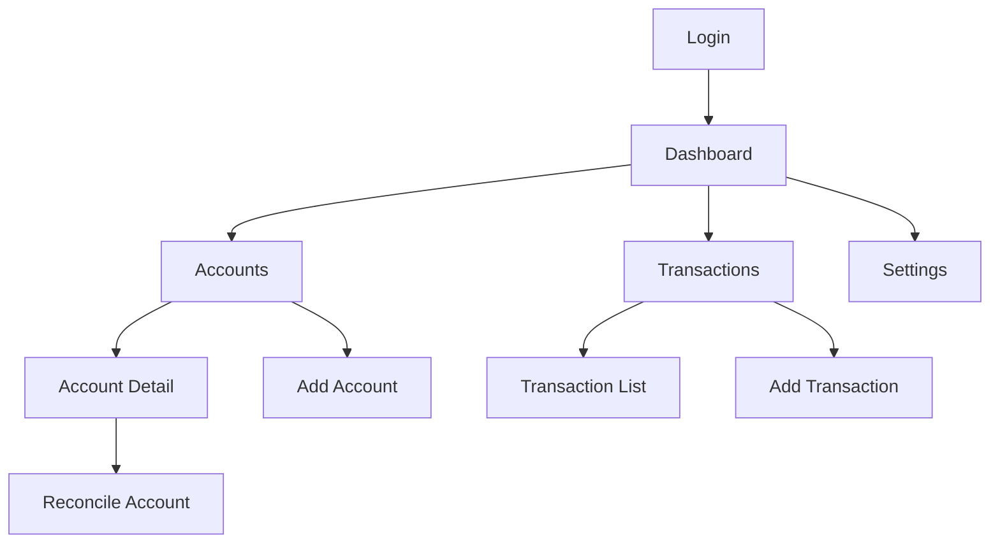

## 1. Product Overview
A production-ready Personal Ledger / Financial Tracker PWA that helps users track expenses across multiple bank accounts with real-time balance calculations, reconciliation features, and offline-first capabilities. Designed for individuals who need to manage personal finances across multiple accounts with accurate balance tracking and basic budgeting insights.

## 2. Core Features

### 2.1 User Roles
| Role | Registration Method | Core Permissions |
|------|---------------------|------------------|
| User | Email registration with password | Full access to own accounts, transactions, and settings |

### 2.2 Feature Module
The financial tracker consists of the following main pages:
1. **Login/Register**: User authentication and account creation
2. **Dashboard**: Monthly financial summary, spending trends, account balances overview
3. **Accounts**: Account management and individual account details with transaction history
4. **Transactions**: Transaction listing, filtering, and creation with quick-add mobile support
5. **Settings**: Categories management, CSV import/export, profile settings

### 2.3 Page Details
| Page Name | Module Name | Feature description |
|-----------|-------------|---------------------|
| Login | Authentication | Email/password login with NextAuth |
| Register | User Creation | Email/password registration with validation |
| Dashboard | Monthly Summary | Display total income, expenses, and net balance for current month |
| Dashboard | Spending Chart | Pie chart showing expenses by category |
| Dashboard | Trend Chart | Line chart showing daily/weekly spending trends |
| Dashboard | Account Overview | Card layout showing all account balances |
| Accounts | Account List | CRUD operations for financial accounts |
| Account Detail | Balance Display | Show computed balance with opening balance and transaction history |
| Account Detail | Recent Transactions | List recent transactions with pagination |
| Account Detail | Reconciliation History | Show past reconciliation entries |
| Transactions | Transaction List | Filterable list with date range, account, category, type filters |
| Transactions | Quick Add | Mobile-optimized transaction creation form |
| New Transaction | Transaction Form | Create expense/income/transfer transactions with required fields |
| Settings | Categories | Manage custom expense/income categories |
| Settings | Import/Export | CSV import and export functionality |
| Settings | Profile | User profile management |

## 3. Core Process
Users start by registering an account, then create their financial accounts (bank accounts, e-wallets, cash). They can then add transactions categorized by type (expense, income, transfer). The dashboard provides an overview of their financial status with charts and summaries. Users can reconcile their accounts by entering statement balances and viewing discrepancies. The app works offline, queuing transactions locally and syncing when back online.

## 4. User Interface Design

### 4.1 Design Style
- **Primary Colors**: Blue (#3B82F6) for primary actions, Green (#10B981) for income, Red (#EF4444) for expenses
- **Secondary Colors**: Gray scale for backgrounds and text (Gray-50 to Gray-900)
- **Button Style**: Rounded corners (8px radius), subtle shadows on hover
- **Typography**: System fonts with clear hierarchy - 16px base, 14px small text, 20px+ for headers
- **Layout**: Card-based design with consistent spacing (8px grid system)
- **Icons**: Minimal line icons from Heroicons or similar icon set

### 4.2 Page Design Overview
| Page Name | Module Name | UI Elements |
|-----------|-------------|-------------|
| Dashboard | Summary Cards | Clean white cards with colored accents, large numbers for totals |
| Dashboard | Charts | Responsive Recharts components with tooltips and legends |
| Accounts | Account Cards | Horizontal cards showing account name, institution, and balance |
| Transactions | Filter Bar | Collapsible filter section with date pickers and dropdowns |
| New Transaction | Form | Two-column layout on desktop, single column on mobile |
| Settings | Menu | Simple list menu with icons and descriptions |

### 4.3 Responsiveness
Desktop-first design with mobile-first approach. Touch-optimized for mobile with thumb-friendly button sizes (minimum 44px). Responsive breakpoints at 640px, 768px, and 1024px. Offline functionality prominently displayed with sync status indicators.

### 4.4 PWA Specific Elements
- Install prompt with app icon and description
- Offline indicator banner when connection lost
- Sync status spinner during background sync
- Cached app shell for instant loading
- Service worker notifications for sync completion