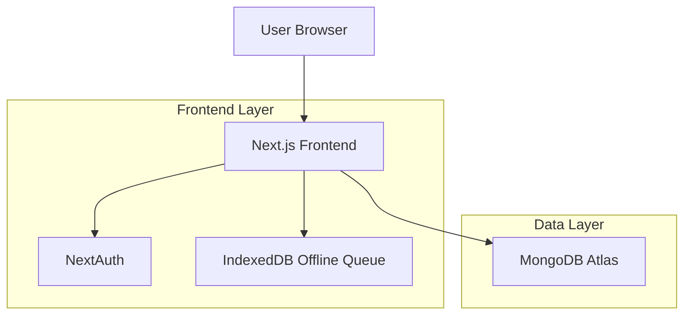
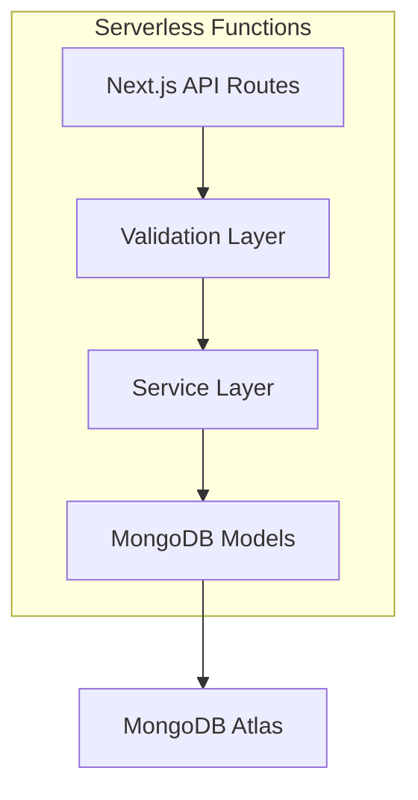
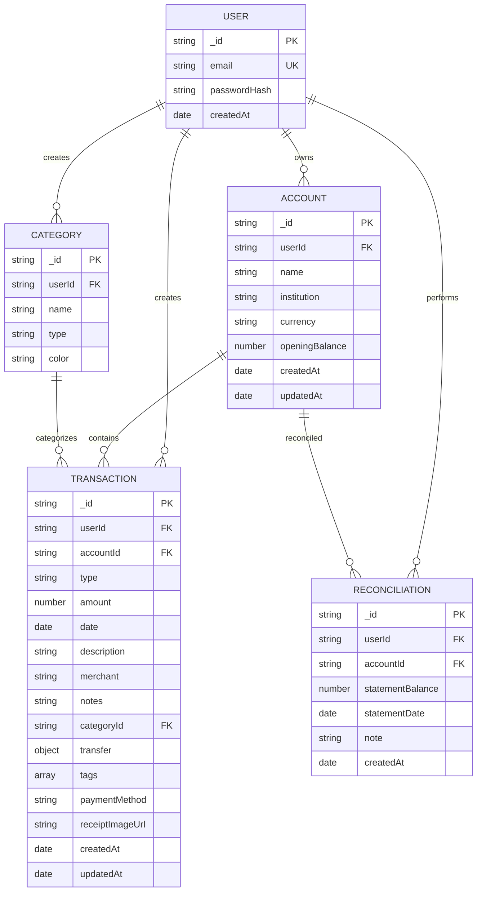

## 1. Architecture Design



## 2. Technology Description
- **Frontend**: Next.js 14+ (App Router) + TypeScript + Tailwind CSS
- **Authentication**: NextAuth with Credentials Provider
- **Database**: MongoDB Atlas with Mongoose ODM
- **Charts**: Recharts for data visualization
- **PWA**: Workbox for service worker and offline functionality
- **State Management**: React Context + SWR for data fetching
- **Validation**: Zod for input validation
- **Offline Storage**: IndexedDB with Dexie for transaction queue

## 3. Route Definitions
| Route | Purpose |
|-------|---------|
| /login | User authentication page |
| /register | User registration page |
| /dashboard | Main dashboard with financial overview |
| /accounts | List all user accounts |
| /accounts/[id] | Individual account details and transactions |
| /transactions | List all transactions with filters |
| /transactions/new | Create new transaction form |
| /settings | User settings and preferences |

## 4. API Definitions

### 4.1 Authentication APIs
```
POST /api/auth/register
```
Request:
| Param Name | Param Type | isRequired | Description |
|------------|------------|------------|-------------|
| email | string | true | User email address |
| password | string | true | User password (min 8 chars) |

Response:
```json
{
  "data": { "userId": "string", "email": "string" },
  "error": null
}
```

### 4.2 Account APIs
```
GET /api/accounts
POST /api/accounts
GET /api/accounts/:id
PATCH /api/accounts/:id
DELETE /api/accounts/:id
```

### 4.3 Transaction APIs
```
GET /api/transactions
POST /api/transactions
GET /api/transactions/:id
PATCH /api/transactions/:id
DELETE /api/transactions/:id
```

### 4.4 Category APIs
```
GET /api/categories
POST /api/categories
GET /api/categories/:id
PATCH /api/categories/:id
DELETE /api/categories/:id
```

### 4.5 Reconciliation APIs
```
POST /api/reconcile
GET /api/reconcile?accountId=...
```

## 5. Server Architecture



## 6. Data Model

### 6.1 MongoDB Collections



### 6.2 MongoDB Indexes
```javascript
// Users
db.users.createIndex({ email: 1 }, { unique: true })

// Accounts
db.accounts.createIndex({ userId: 1 })
db.accounts.createIndex({ userId: 1, name: 1 })

// Transactions
db.transactions.createIndex({ userId: 1 })
db.transactions.createIndex({ userId: 1, accountId: 1 })
db.transactions.createIndex({ userId: 1, date: -1 })
db.transactions.createIndex({ userId: 1, categoryId: 1 })

// Categories
db.categories.createIndex({ userId: 1 })

// Reconciliations
db.reconciliations.createIndex({ userId: 1, accountId: 1 })
db.reconciliations.createIndex({ userId: 1, accountId: 1, statementDate: -1 })
```

### 6.3 Mongoose Schema Examples
```javascript
// Transaction Schema
const transactionSchema = new mongoose.Schema({
  userId: { type: mongoose.Schema.Types.ObjectId, ref: 'User', required: true },
  accountId: { type: mongoose.Schema.Types.ObjectId, ref: 'Account', required: true },
  type: { type: String, enum: ['expense', 'income', 'transfer'], required: true },
  amount: { type: Number, required: true, min: 0 },
  date: { type: Date, required: true },
  description: { type: String, required: true },
  merchant: String,
  notes: String,
  categoryId: { type: mongoose.Schema.Types.ObjectId, ref: 'Category' },
  transfer: {
    toAccountId: { type: mongoose.Schema.Types.ObjectId, ref: 'Account' },
    transferGroupId: String
  },
  tags: [String],
  paymentMethod: String,
  receiptImageUrl: String
}, { timestamps: true })
```

## 7. PWA Configuration
- **Web App Manifest**: Installable app with icons, theme color, and display settings
- **Service Worker**: Workbox-based caching strategy for offline functionality
- **Offline Queue**: IndexedDB storage for pending transactions using Dexie
- **Background Sync**: Automatic sync when connection restored
- **Cache Strategy**: Stale-while-revalidate for API calls, cache-first for static assets